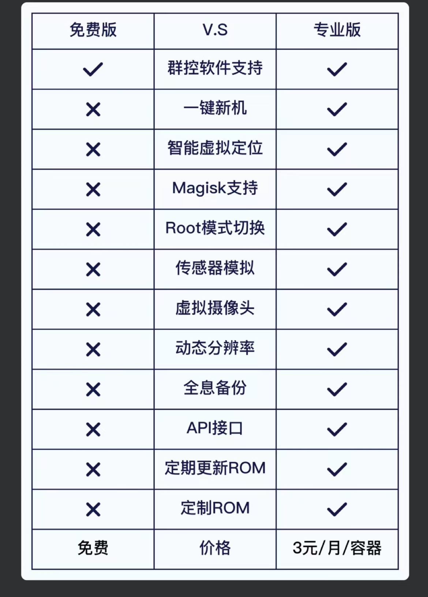

# docker-dobox/免费版
B站：https://space.bilibili.com/36958872

- 下方有微信群二维码
- 免费群控进群统一发放

#### 介绍
docker-android 
- 容器安卓12 gpu直通 编码器直通 性能无损
- 对内核有特定要求,目前适配尽力有限,进群配合适配


#### 安装要求

1.  rk3588/s
2.  必须插上nvme
3.  刷写我们制作好的rom

#### 使用说明

```
docker run -itd --rm --privileged \
  --pull always \
  -v /mmc/zcg1:/data \
  -v /dev/net/tun:/dev/tun \
  -v /dev/mali0:/dev/mali0 \
  -p 5501:5555 \
  --name dobox1 \
  registry.cn-hangzhou.aliyuncs.com/whsyf/dobox:rk3588-202303010
  
docker run -itd --rm --privileged \
  --pull always \
  -v /mmc/zcg2:/data \
  -v /dev/net/tun:/dev/tun \
  -v /dev/mali0:/dev/mali0 \
  -p 5502:5555 \
  --name dobox2 \
  registry.cn-hangzhou.aliyuncs.com/whsyf/dobox:rk3588-202303010
  
```

